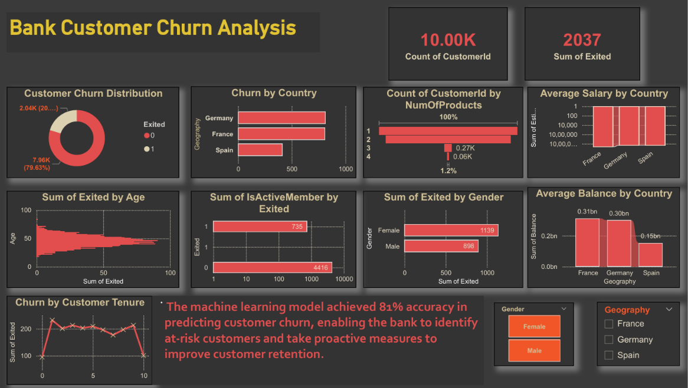

<h1 align="center">🏦 Bank Customer Churn Analysis & Prediction</h1>

<h3 align="center">
End-to-End Data Analytics, Machine Learning & Business Intelligence Project
</h3>

<p align="center">


</p>

---

# 📊 Power BI Dashboard

<p align="center">

</p>

### 📄 Dashboard Report

📥 **Download Full Dashboard PDF**

[👉 View Full Dashboard PDF](./Customur_banking_Analysis_Dashboard%20ori%20actual.pdf)

---

# 🚀 Project Overview

Customer churn is one of the most critical challenges in the banking industry. Acquiring new customers is significantly more expensive than retaining existing customers.

This project combines **Python, SQL, MySQL, Machine Learning, and Power BI** to analyze customer behavior, identify churn patterns, and predict customers likely to leave the bank.

The solution provides actionable business insights that help improve customer retention and support data-driven decision-making.

---

# 🎯 Business Objectives

- Analyze customer churn behavior
- Identify factors influencing customer attrition
- Build a predictive Machine Learning model
- Perform SQL-based business analysis
- Create an interactive Power BI dashboard
- Generate actionable business insights

---

# 📈 Project Statistics

| Metric | Value |
|----------|----------|
| Total Customers | 10,000 |
| Churned Customers | 2,037 |
| Churn Rate | 20.37% |
| Machine Learning Accuracy | 81% |
| Countries Analyzed | France, Germany, Spain |
| Database | MySQL |
| Dashboard Tool | Power BI |

---

# 🔄 Project Workflow

```text
Raw Banking Dataset
          ↓
Data Cleaning & Preprocessing
          ↓
Exploratory Data Analysis (EDA)
          ↓
Feature Engineering
          ↓
Machine Learning Model
          ↓
SQL Business Analysis
          ↓
Power BI Dashboard
          ↓
Business Insights & Recommendations
```

# 🛠 Technology Stack

## Programming

- Python

## Data Analysis

- Pandas
- NumPy

## Data Visualization

- Matplotlib
- Seaborn

## Machine Learning

- Scikit-Learn

## Database

- SQL
- MySQL

## Business Intelligence

- Power BI

## Version Control

- Git
- GitHub

---

# 🤖 Machine Learning Model

The Machine Learning model was developed to predict customer churn and identify customers at risk of leaving the bank.

### Model Performance

| Metric | Score |
|----------|----------|
| Accuracy | 81% |
| Prediction Type | Binary Classification |
| Dataset Records | 10,000 |

### ML Pipeline

✅ Data Cleaning

✅ Feature Engineering

✅ Data Transformation

✅ Train-Test Split

✅ Model Training

✅ Model Evaluation

✅ Churn Prediction

---

# 🗄 SQL Analysis

SQL was used to:

- Create and manage the customer database
- Store customer information
- Analyze churn patterns
- Generate business insights
- Support dashboard reporting

### SQL Insights

- Customer Churn Rate
- Churn by Country
- Churn by Gender
- Product Usage Analysis
- Customer Tenure Analysis
- Active Member Analysis
- Balance Analysis
- Salary Analysis

---

# 📊 Dashboard Features

✔ Customer Churn Distribution

✔ Churn by Country

✔ Churn by Gender

✔ Age-wise Churn Analysis

✔ Customer Product Distribution

✔ Customer Tenure Analysis

✔ Active Member Analysis

✔ Average Salary by Country

✔ Average Balance by Country

✔ Interactive Filters & Slicers

---

# 📈 Key Business Insights

### 🌍 Geography Analysis

Germany recorded the highest customer churn among all analyzed countries.

### 👥 Customer Demographics

Customers aged between **40–55 years** showed a significantly higher tendency to churn.

### 💳 Product Analysis

Most customers use only **1–2 banking products**, creating opportunities for cross-selling additional services.

### 📉 Customer Churn

The overall churn rate reached **20.37%**, highlighting the importance of proactive retention strategies.

### 🤖 Predictive Analytics

The Machine Learning model achieved **81% accuracy** in predicting customer churn.

---

# 💼 Business Impact

This project helps banks:

- Identify high-risk customers
- Improve customer retention
- Reduce customer churn
- Increase customer engagement
- Support data-driven business decisions
- Enhance profitability

---

# 📂 Repository Structure

```text
Bank-Customer-Churn-Analysis-and-Prediction
│
├── dashboard.png.png
├── Customur_banking_Analysis_Dashboard ori actual.pdf
├── README.md
│
├── Python
├── SQL
├── PowerBI
└── Dataset
```

---

# 🏆 Project Outcome

Successfully developed a complete Customer Churn Prediction and Analytics solution integrating:

✅ Python

✅ SQL

✅ MySQL

✅ Machine Learning

✅ Power BI

The project demonstrates expertise in:

- Data Analytics
- Data Visualization
- Business Intelligence
- Database Management
- Machine Learning
- Predictive Analytics

---

<h2 align="center">⭐ Star this repository if you found it useful!</h2>

<h3 align="center">👨‍💻 Developed by SAI VAMSHI MIRYALKAR</h3>
